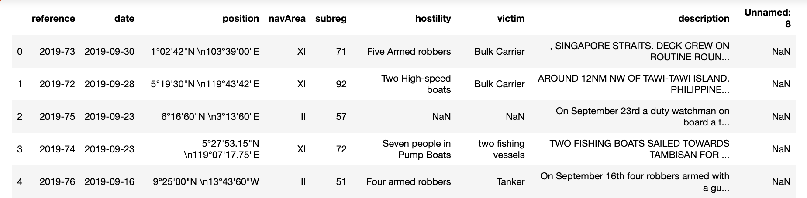
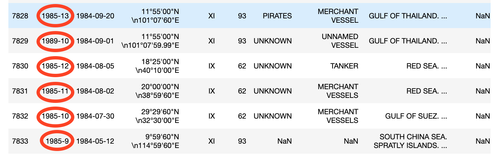

# 
International Maritime Piracy and Robbery at Sea 

## 
Alex Rook 

Below is map plotting all of the reported international piracy and robbery at sea events since 1979.

The data comes from the National Geospatial Intelligence (NGA) and was recently released as a .csv file. I like to sail and traveling by boat has always been an interest so this was an appealing dataset to me. In general it looks like this:

After spending a bit of time with the data I noticed few things that I thought were interesting but were things hinder analysis. For example:

* There was a whopping 1224 different _types_ of victims. Broadly, these could be categorized as:
    - Definite misentries (Thieves, pirates, SUPICIOUS [sic] APPROACH) 
    - Vague misentries (KIDNAPPED, MEN)
    - Improbable misentries (warship,PHILIPPINE NAVY, SOUTH KOREAN COAST GUARD -- but there was the USS COLE)
    - What appears to be an attempt at standardization (e.g. bulk carrier, fishing vessel)
    - Specific vessel names

* There were 327 different types of hostilities, mostly misspellings or inconsistent capitalization entries but a few gems such as:
    - Ethopia, Iran, IRANIAN NAVAL FORCES, HAITIAN AUTHORITIES, CUBAN GUNBOAT and CHINA.  
    - STOWAWAYS, Tuna boat

* The reference numbers (year-event number) were substantially inaccurate

You can see the difference is between one and five years but even at later years, it can be several months.

# Goals
So, from all this I've settled on a set of goals centered around relabeling the data based on the content from the event descriptions. To make this happen,I wanted to look at both K-means and Latent Dirichlet Allocation (LDA). My hypothesis is that LDA would preform a bit better due to a set of underlying (aka, latent) features that weren't obvious.

