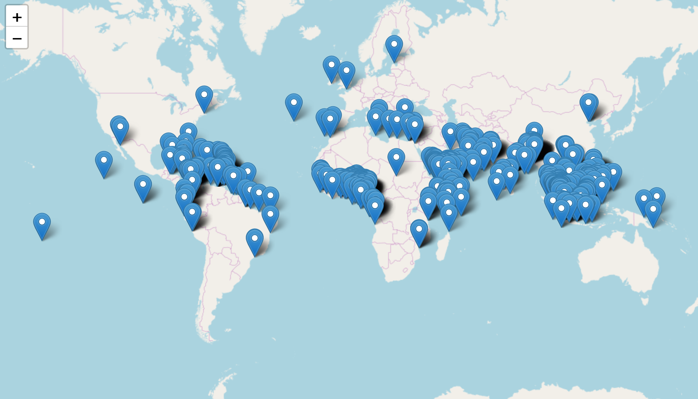
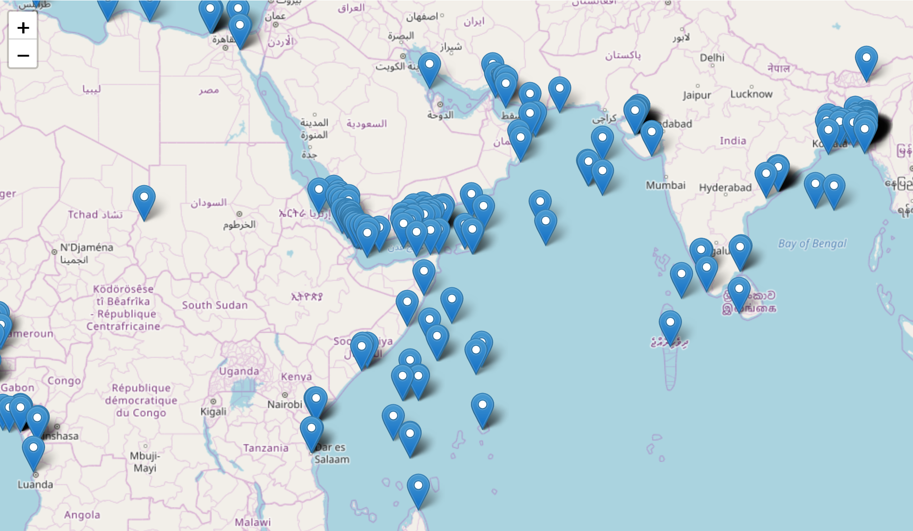
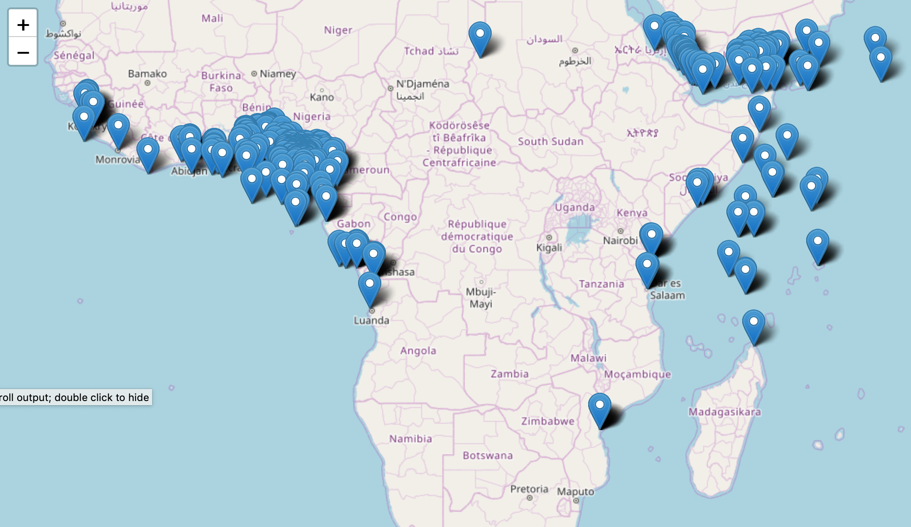
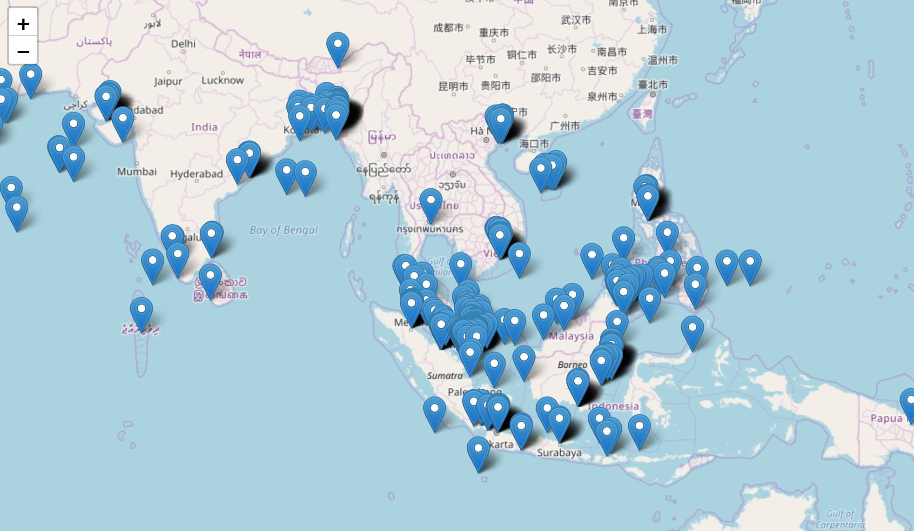
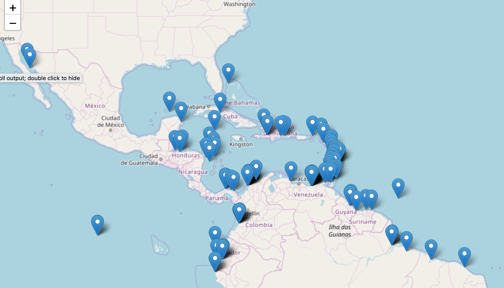
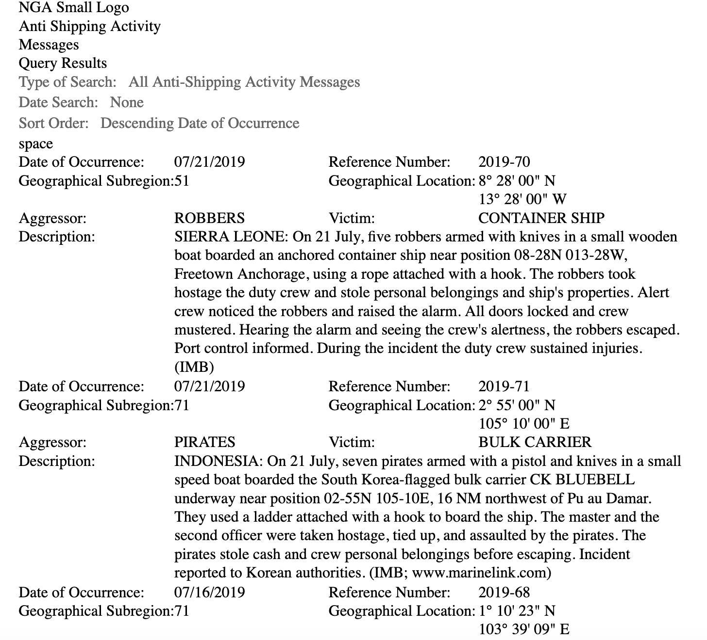
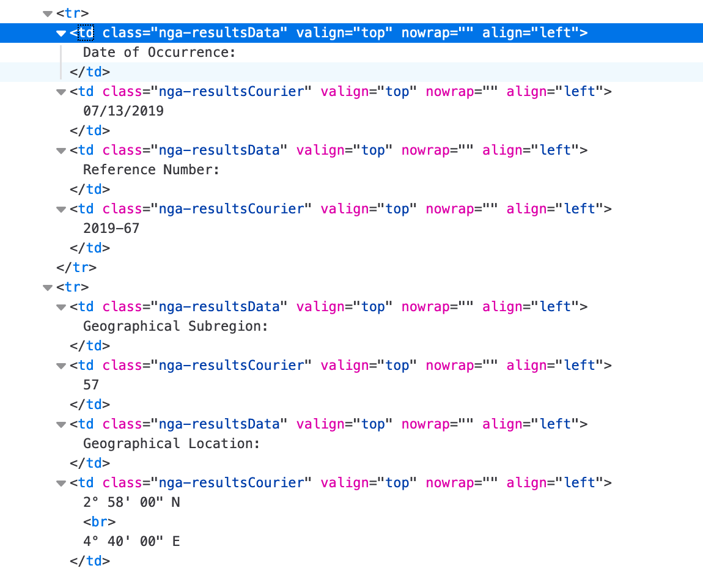
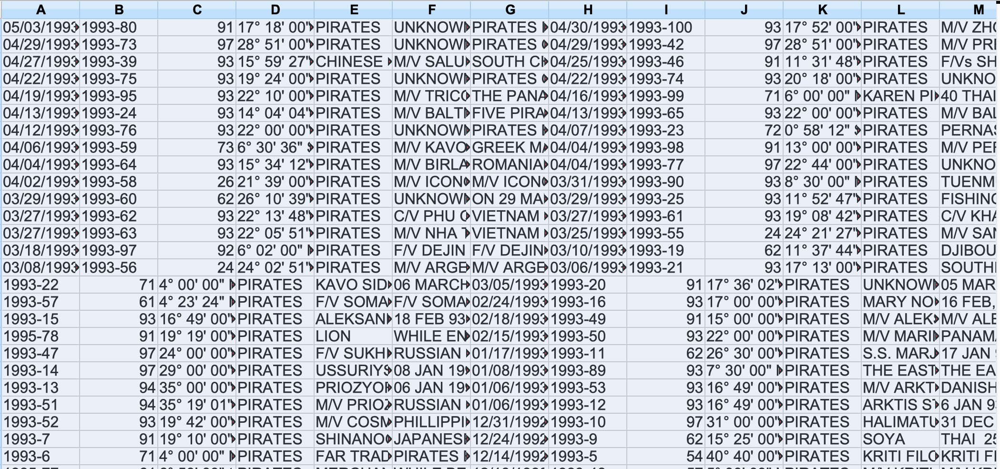
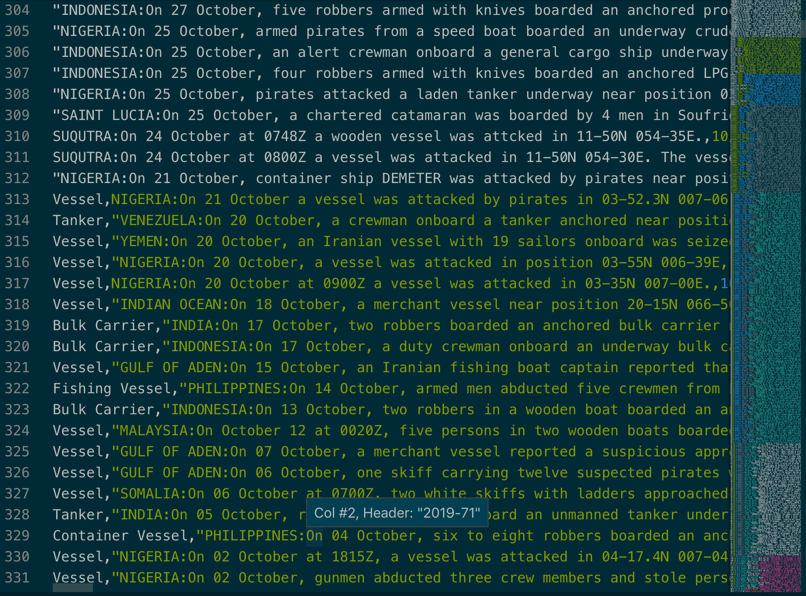

# International Maritime Piracy


## Background & Motivation

Around 2012, the US population became aware that pirates really were, shall we say, a thing and they weren't swashbuckling anti-heroes we had all hoped for. I was curious about what's happened since then. Specifically, I wanted to know:

- What is the currnet status of maritime piracy worldwide?
- What trends, if any, can we observe?
- How has piracy changed over time?

But, like a movie with a plot twist, this didn't turn out as I expected. I had thought I would be spend short amount of time on collecting the data since it was readily available and then use the remaining time to develop mastery of pandas and folium in order to answer a number of question about trends over time and by location.

Instead what I got was practice with some old but powerful tools, regex and sed, a bit of practice with pandas and thankfully pleasant acquaintance with folium.

## Data

The data came from the National Geospatial-Intelligence Agency (NGA)
[Anti-shipping Activity Messages](http://bit.ly/2kA6j1N). The dataset is quite clean but is completely tabular so parsing it turned out to be a much more intensive operation than I had planned.
s

## Exploratory Data Analysis

First a quick overview. Piracy is alive and well


Piracy in HOA is also still alive and well


Piracy in Nigeria?!? Yep. Oil.


Less well known is that piracy in South East Asia is still doing just fine, thank you.


And finally, piracy in the Caribbean is still a thing.


## Issues & Lessons Learned

### 1) Virtual Environments for Python Basically Suck:

I initially went with a conda virtual environment because without environments, python can easily become a hodge-podge of conflicting packages and multiple versions of python on the machine and read that conda environments were much better. However, I was greeted with the following:

    requests.exceptions.SSLError: HTTPSConnectionPool(host='msi.nga.mil', port=443): Max retries exceeded with url: /NGAPortal/msi/query_results.jsp?MSI_queryType=ASAM&MSI_generalFilterType\=All&MSI_generalFilterValue=-999&MSI_additionalFilterType1=None&MSI_additionalFilterType2=-999&MSI_additionalFilterValue1=-999&MSI_additionalFilterValue2=-999&MSI_outputOptionType1=SortBy&MSI_outputOptionType2=-999&MSI_outputOptionValue1=Date_DESC&MSI_outputOptionValue2=-999&MSI_MAP=-999 (Caused by SSLError(SSLError("bad handshake: Error([('SSL routines','tls_process_server_certificate', 'certificate verify failed')])")))

My first thought was this has something to with Requests and BeautifulSoup not being able to handle SSH traffic because of outdated information about them. A little more research and I found that wasn't the case. Then I thought perhaps I was being shut down for looking like a computer, so I added in a User Agent statement. 

Eventually I found out that while python 3.7 is my system python, it wasn't for the conda environment even though the conda download was for 3.7. Once that was fixed... still no love.

### 2) Long URLs need to be triple quoted

    /NGAPortal/msi/query_results.jsp?MSI_queryType%20%20%20%20=ASAM&MSI_generalFilterType=All&MSI_generalFilterValue=-999&MSI_additional%20%20%20%20FilterType1=None&MSI_additionalFilterType2=-999&MSI_additionalFilterValue1%20%20%20%20=-999&MSI_additionalFilterValue2=-999&MSI_outputOptionType1=SortBy&MSI_%20%20%20%20outputOptionType2=-999&MSI_outputOptionValue1=%20%20%20%20Date_DESC&MSI_outputOptionValue2=-999&MSI_MAP=-999 (Caused by SSLError(SSLError("bad handshake: Error([('SSL routines', 'tls_process_server_certificate', 'certificate verify failed')])"))) (scraping_the_pirates) Alexs-MacBook-Pro:Capstone Projects alex$ 


### 3) Web Scraping Means "I Hope This Isn't Just One Giant Table"

#### My data is like a beautiful model:




#### ... who is insane subsists mostly on cocaine and champagne



Beautiful Soup handles HTML that has unique identifiers well. But that's not true for tabular data which mine consisted completely from. There is another library, LXML which is sometimes helpful, but not in this case.

## 3) Web Scraping Is Messy

Since there was no tooling that I was familiar with that could parse the tables for me, I ended up using a combination of regex and OpenOffice which has good regex support. After cleaning the data, I saved as tab-delimited as commas, semicolons, dashes were all already in use but tabs weren't. Unfortunately, regex is a perishable skill and there are a number of different flavors of it. Searches with both look-aheads and look-behinds are tricky as were for some reason getting rid of new lines. So I used sed

````
    sed '/^$/d' file.txt > no_empty_lines.txt
````

## 4) Visualization Of Data Throughout EDA Is Key

Even with carefully setting aside copies of data in case something went wrong, there were a number of gremlins that popped up. Originally I used OpenOffice 



But found that VS Code, particularly with the Rainbow CSV extension, was a much better solution.



### 4) Dubstep -- I Never Should Have Left You

## Next Steps

I'm not really done with this; the questions I had at the beginning are still there. Here is where I want to go next:

- find a better solution for parsing the data
- time series analysis and categorization of the data
- gain fluency rather than just familiarity with folium. 
